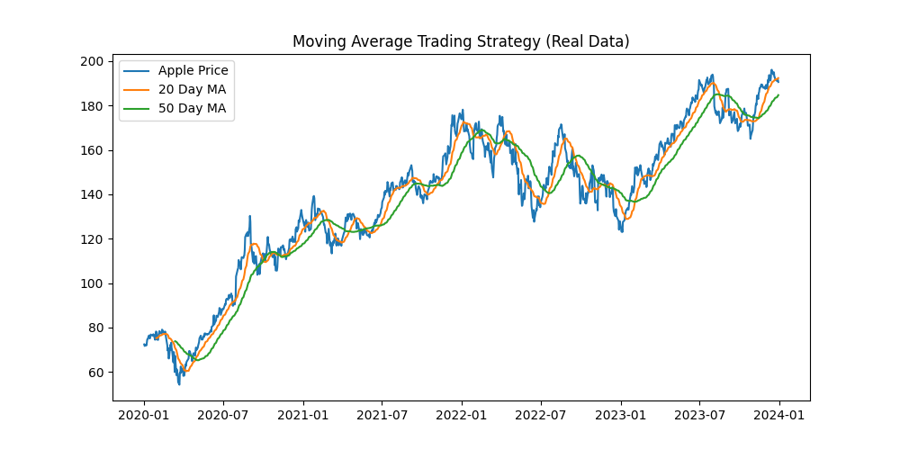

# Algorithmic Trading Strategy

This project implements a simple algorithmic trading strategy using Python.

## Strategy Overview
The strategy analyzes historical market data and generates trading signals based on quantitative rules.

## Features
- Data processing with pandas
- Signal generation
- Strategy backtesting
- Performance visualization

## Files
trading_strategy.py → main trading algorithm  
trading_strategy_real_data.png → strategy performance output

## Project Structure

trading_strategy.py → main trading algorithm

trading_strategy_real_data.png → strategy performance output

## Technologies Used
Python  
Pandas  
NumPy  
Matplotlib

## Goal
Demonstrate practical quantitative trading model development.
## Strategy Output

