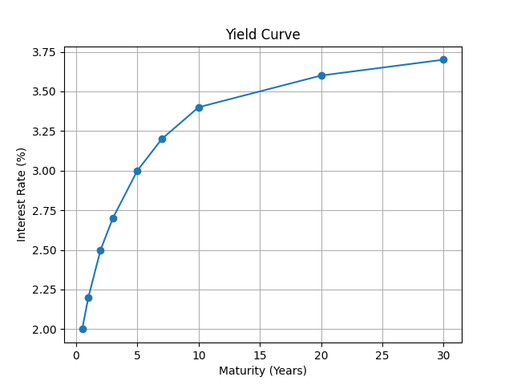

# Yield Curve Modeling (Nelson-Siegel Model)

## Overview

This project implements the Nelson-Siegel yield curve model used in quantitative finance to estimate the term structure of interest rates.

The yield curve represents the relationship between bond yields and their maturities. It is widely used in fixed income markets for bond pricing, interest rate forecasting, and risk management.

## Model Explanation

The Nelson-Siegel model represents the yield curve using three components:

Level – long-term interest rate level
Slope – short-term rate movement
Curvature – medium-term hump in the yield curve

These factors allow the model to flexibly fit real-world yield curve shapes.
## Example Output

## Tools Used

Python
NumPy
Matplotlib
SciPy
## Example Output

## Applications

Bond pricing
Interest rate modeling
Risk management
Portfolio construction
